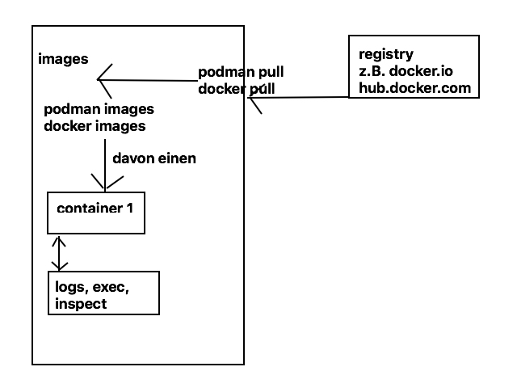

# Podman 

## Aufbau (Wirkweise) 



## Walkthrough 

```
# runtergeladenen images
podman images
# image von online ziehen (registry) 
# Sucht bei redhat danach bei docker.io 
podman pull alpine:latest
# Image ist jetzt lokal vorhanden 
podman images
# Container mit diesem image starten
podman run --name=myalpine alpine
# Prozess läuft nicht mehr, da bereits beendet 
podman ps
# hiermit werden alle prozesse angezeigt auch die beendeten.
podman ps -a

# Beendeten container löschen über container - id (muss eindeutig sein bei z.B. 2 Ziffern) 
podman rm 08
# liste der container ist jetztleer
podman ps -a 

```

## Container interactive mit terminal 

```
# das sind die Optionen -i -t 
podman run -it --name=myalpine2 alpine

```

## Walkthrough II

```
# interactive mit terminal und detached
# Detached - es läuft weiter im hintergrund 
podman run -dit --name=myalpine3 alpine
# in maschine reinwechseln, Kommanda ls -la ausführen
# danach wieder raus
podman exec -it myalpine3 ls -la

podman ps -a

# geht nicht, weil es im container keine bash gibt
# das ist bei alpine der fall, hier gibt es nur busybox
podman exec -it myalpine3 bash

# einen sh - befehl gibt in jedem Linux
# dieser verweist auf die aktuelle Shell
podman exec -it myalpine3 sh

# Die Ausgabe des ersten Befehls wird geloggt 
podman run -it --name=myalpine4 alpine ls -la
# Logs anzeigen 
podman logs myalpine4

```

## Configuration abfragen

```
# Alle Konfigurationen
podman inspect myalpine3 
# oder container id
podman inspect a23e

podman inspect -f "{{.NetworkSettings.IPAddress}}" myalpine3
10.88.0.7


```

## Aufräumen (tabula rasa) 

```
# alle container und die, die noch laufen, vorher stoppen
podman rm -a --force 

# alle runtergeladenen images löschen
podman rmi -a 
```

## Image bauen 

```
mkdir myimage
cd myimage
```


```
# vi Dockerfile beispiel ubuntu mit folgendem Inhalt 
FROM ubuntu:20.04

RUN apt-get update
RUN apt-get install -y nginx

ENV NEW_MODE laola
ENV TRAINING_VERSION 1.0 
```

```
FROM centos:latest

RUN yum install -y nginx 
ENV NEW_MODE laola
ENV TRAINING_VERSION 1.0 
```

```
# choose any name for the image with -t 
# does not need to be the directory name 
podman build -t myimage . 

# image als Basis für einen container verwenden 
podman run -dit --name mycontainer myimage 

# Now work in the container if you want 
podman exec -it mycontainer bash 
## do whatever you want in the container 
## e.g. env
```
